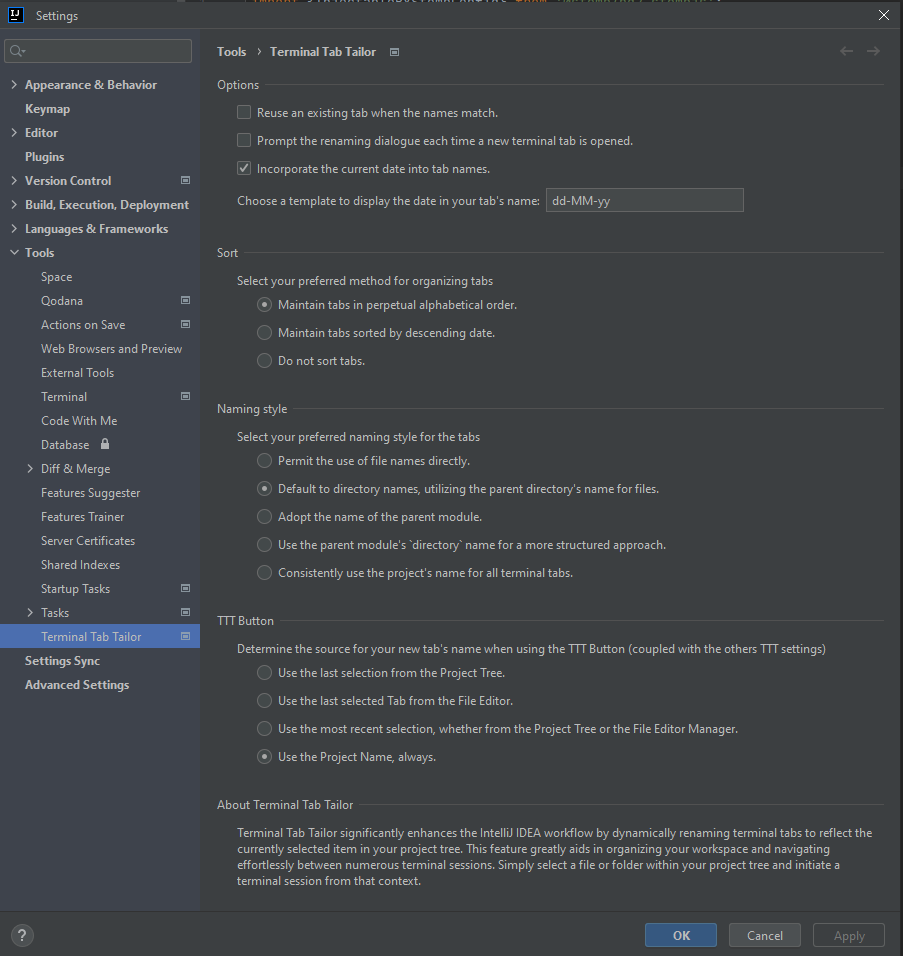
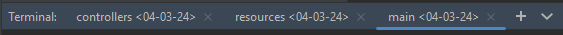
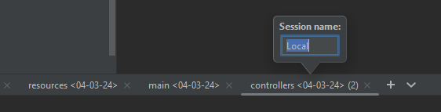

# TerminalTabTailor   

Terminal Tab Tailor significantly enhances the IntelliJ IDEA workflow by dynamically renaming terminal tabs to reflect the currently selected item in your project tree. This feature greatly aids in organizing your workspace and navigating effortlessly between numerous terminal sessions.

Simply select a file or folder within your project tree and initiate a terminal session from that context.

**Pro-tip**: *Enhance your efficiency by assigning a shortcut to the "Open In > Terminal" action.*

Configurability is at the heart of Terminal Tab Tailor; venture into the settings to tailor its behavior to your needs:
* Prompt the renaming dialogue each time a new terminal tab is opened.
* Reuse an existing tab when the names match.
* Maintain tabs in perpetual alphabetical order.
* Maintain tabs sorted by descending date.
* Incorporate the current date into tab names (with a customizable pattern, defaulting to dd-MM-YY).

Choose from a variety of naming conventions to suit your workflow:
* Permit the use of file names directly.
* Default to directory names, utilizing the parent directory's name for files.
* Adopt the name of the parent module.
* Use the parent module's directory name for a more structured approach.
* Consistently use the project's name for all terminal tabs.
