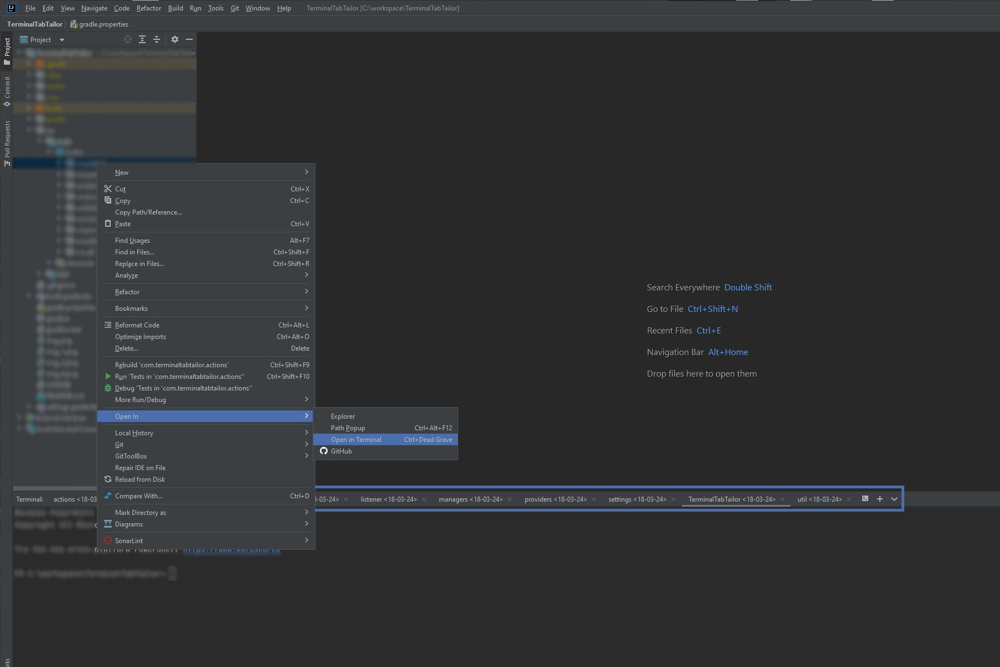
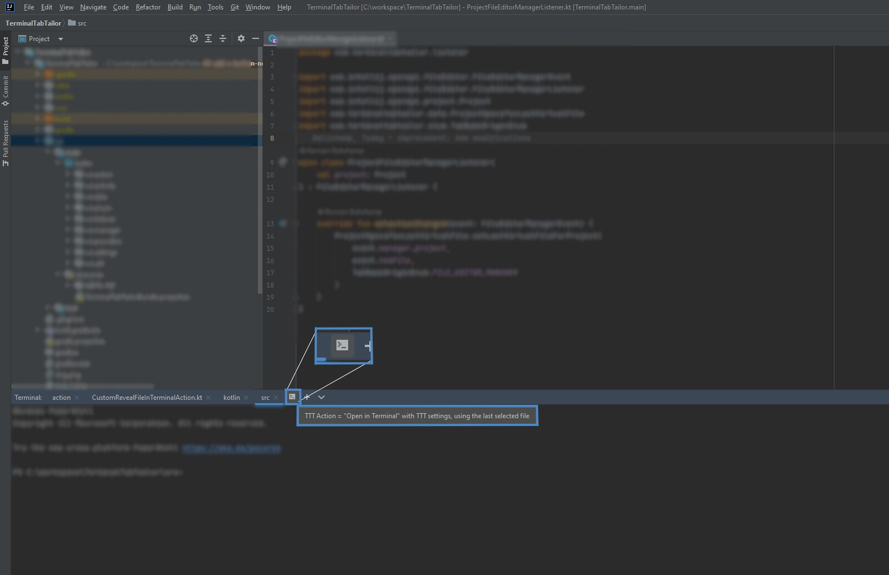
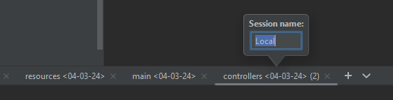
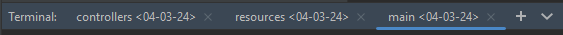
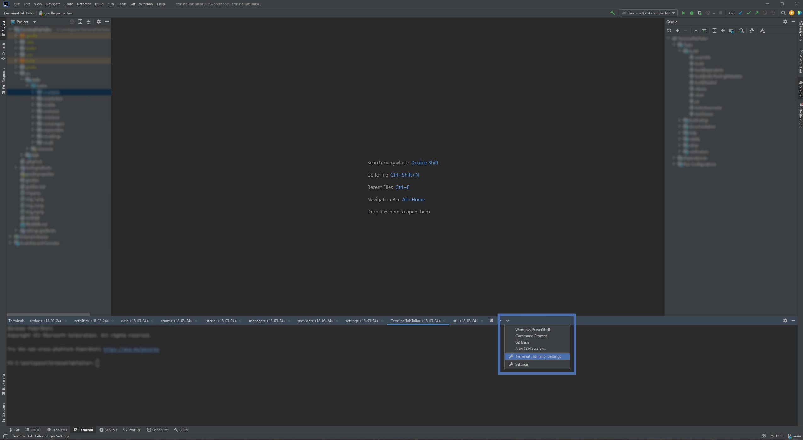
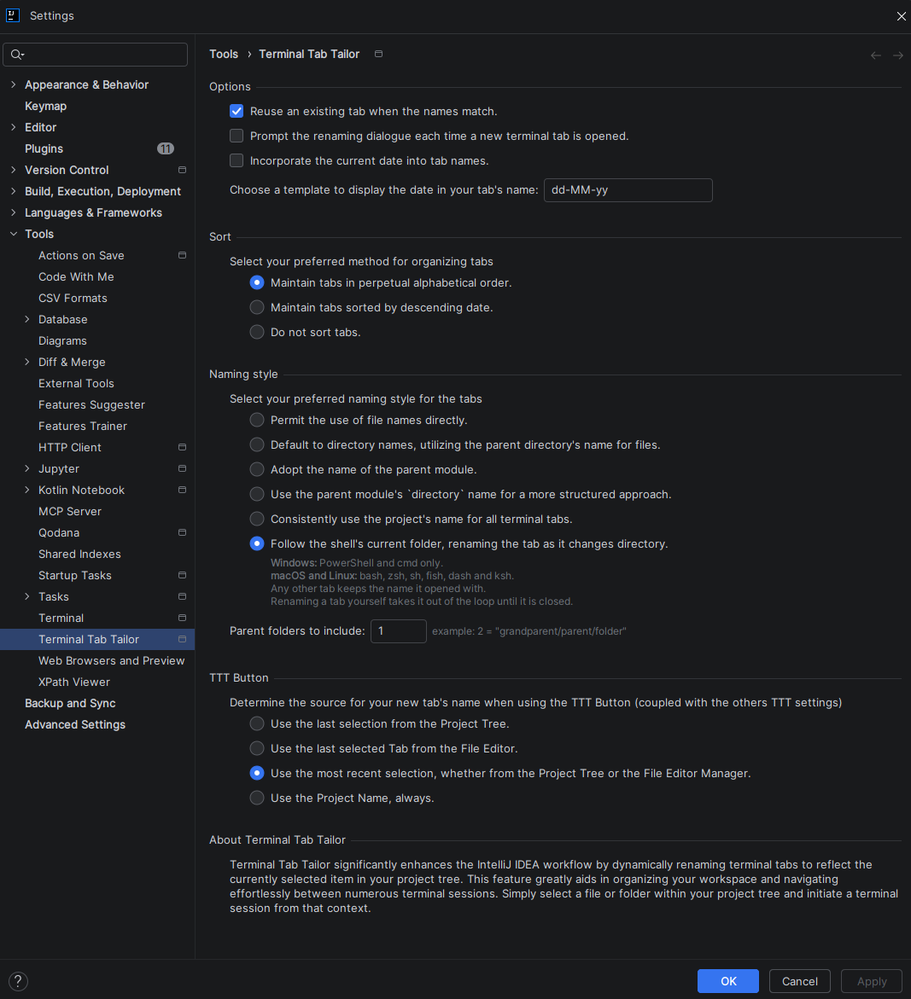

# TerminalTabTailor   

Terminal Tab Tailor significantly enhances the IntelliJ IDEA workflow by dynamically renaming terminal tabs to reflect the currently selected item in your project tree. This feature greatly aids in organizing your workspace and navigating effortlessly between numerous terminal sessions.

## Getting started

Select a file or folder within your project tree and initiate a terminal session from that context. The new tab is named after what you selected.

*Open In* offers two entries — **Terminal (Reworked)** and **Terminal (Classic)** — so you pick the engine on the spot. Both name the tab the same way.

**Ctrl+Shift+X** opens a reworked terminal for the current selection straight away. Rebind it under *Settings > Keymap* if it clashes with your own shortcuts.

## Three ways to open a tailored tab

### Open In > Terminal

Terminal Tab Tailor takes over the IDE's own "open in terminal" entries, relabelling them **Terminal (Reworked)** and **Terminal (Classic)**. Every place you already open a terminal from — the project tree context menu, the Open In submenu, your keyboard shortcut — produces a tailored tab.

Why two? Neither of the IDE's terminal-creation APIs follows the *Terminal engine* setting: one always builds a classic terminal, the other always a reworked one. Rather than guess for you, the plugin lets you choose.

### The TTT button

One click in the terminal toolbar opens a tab from your most recent selection, without going back to the project tree first.

Choose what the button follows:
* Use the last selection from the Project Tree.
* Use the last selected Tab from the File Editor.
* Use the most recent selection, whether from the Project Tree or the File Editor.
* Use the project name, always.

### Rename Session

Right-click any terminal tab and choose "Rename Session" to name it yourself. Your sort order is re-applied straight away and the renamed tab stays selected, so it never disappears into the middle of the tab strip.

You can also have that dialogue appear automatically every time a new tab is opened.

## How tabs get named

Choose from a variety of naming conventions to suit your workflow:
* Permit the use of file names directly.
* Default to directory names, utilizing the parent directory's name for files.
* Adopt the name of the parent module.
* Use the parent module's directory name for a more structured approach.
* Consistently use the project's name for all terminal tabs.
* Follow the shell's current folder, renaming the tab as it changes directory.

Optionally the current date is appended in angle brackets, so a tab reads `main <03-04-24>`. The date format is yours to change; it defaults to `dd-MM-yy`.

### Adding parent folders

`src` alone tells you little when every module has one. **Parent folders to include** prepends as many levels
as you ask for:

| Setting | A tab in `~/workspace/TerminalTabTailor/src` reads |
| --- | --- |
| `0` | `src` |
| `1` (default) | `TerminalTabTailor/src` |
| `2` | `workspace/TerminalTabTailor/src` |

It applies to every naming style that names a tab after a directory — parent directory name, parent module's
directory, and follow the shell's current folder below. A folder with fewer parents than asked for simply
shows all it has, and levels are always joined with `/` whatever separator the shell reports, so a tab reads
the same on every platform.

The two naming styles that are not paths — *module name* and *project name* — are unaffected: prepending a
folder to a module name would say nothing about where the tab sits.

## Follow the shell's current folder

Pick this naming style and a tab stops being named once and for all: it follows its shell instead. It opens
named after the folder it starts in — with as many parent folders as the setting above asks for — then
`cd ../frontend` and the tab becomes `frontend`, `cd ..` and it becomes what the parent is called. It applies
to every tab in the Terminal tool window, on both engines, whatever opened them.

> **Reworked engine:** PowerShell, cmd, and every Unix shell below are followed. **Classic engine, on
> Windows:** cmd only — PowerShell and pwsh cannot be, for a reason outside this plugin's control (see
> below). Any other tab simply keeps the name it opened with.

Renaming a tab yourself takes it back out of the loop — your name sticks until the tab is closed. The date
option still applies, so a followed tab reads `frontend <03-04-24>`.

### Why other shells are not followed

A shell's working directory reaches the IDE one of two ways: the shell reports it through *shell integration*
(the reworked engine's only source, and the more reliable one — the shell itself says where it is), or the IDE
asks the OS for the directory of the process it spawned (the classic engine's only source, since there is no
public API exposing a classic tab's shell integration to a plugin).

| Shell | Why the classic engine can't follow it |
| --- | --- |
| PowerShell, pwsh | `Set-Location` never calls Win32's `SetCurrentDirectory()` — PowerShell tracks `$PWD` through its own provider system, entirely apart from the OS-level directory this engine reads. Open upstream: [PowerShell/PowerShell#17149](https://github.com/PowerShell/PowerShell/issues/17149). The reworked engine is unaffected — shell integration reads what the shell itself reports, not the OS-level directory. |
| WSL, `ssh`, `docker exec` | the spawned process is only a launcher; the directory it holds belongs to a different machine or filesystem than the shell's |
| Git Bash, MSYS, Cygwin | a POSIX port keeps an *emulated* working directory it never pushes to the Win32 process, so the process stays where the tab opened |

Git Bash, MSYS and Cygwin also get no shell integration — IntelliJ matches the shell name against `bash`, and
on Windows the executable is `bash.exe`, so the integration script is never injected. With both sources silent
there is nothing left to read, and rather than show a folder the shell left long ago, the tab keeps its name.

Open WSL tabs with **Terminal (Reworked)**, or set *Settings > Tools > Terminal > Terminal engine* to the
reworked one, and they follow their shell like any other — the same fix works for classic PowerShell tabs,
since the reworked engine reads shell integration instead of the OS.

## Keeping tabs tidy

* Reuse an existing tab when the names match, instead of piling up duplicates — the matching tab is brought back up for you.
* Keep tabs in perpetual alphabetical order, keep them sorted by descending date, or leave them exactly where you put them.
* Whichever you choose, opening or reusing a tab brings the terminal window to the front and selects that tab.

## Settings

Configurability is at the heart of Terminal Tab Tailor. There are two ways into the settings:

* **Settings > Tools > Terminal Tab Tailor**
* **Terminal Tab Tailor Settings**, in the `⌄` dropdown next to `+` in the Terminal tool window

| Setting | Default |
| --- | --- |
| Reuse an existing tab when the names match | On |
| Prompt the renaming dialogue each time a new terminal tab is opened | Off |
| Incorporate the current date into tab names | On |
| Parent folders to include | `1` |
| Date template | `dd-MM-yy` |
| Sort | Alphabetical |
| Naming style | Parent directory name |
| TTT button source | Most recent — Project Tree or File Editor |
