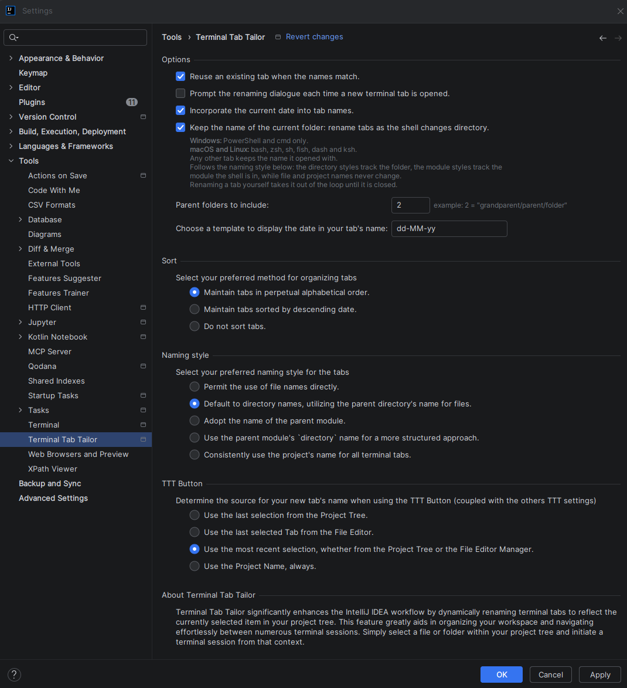

# TerminalTabTailor   

Terminal Tab Tailor significantly enhances the IntelliJ IDEA workflow by dynamically renaming terminal tabs to reflect the currently selected item in your project tree. This feature greatly aids in organizing your workspace and navigating effortlessly between numerous terminal sessions.

## Getting started

Select a file or folder within your project tree and initiate a terminal session from that context. The new tab is named after what you selected.

**Pro-tip**: *Enhance your efficiency by assigning a shortcut to the "Open In > Terminal" action.*

## Three ways to open a tailored tab

### Open In > Terminal

Terminal Tab Tailor takes over the IDE's own "Open in Terminal" action. Every place you already open a terminal from — the project tree context menu, the Open In submenu, your own keyboard shortcut — produces a tailored tab. There is nothing new to learn.

### The TTT button

One click in the terminal toolbar opens a tab from your most recent selection, without going back to the project tree first.

Choose what the button follows:
* Use the last selection from the Project Tree.
* Use the last selected Tab from the File Editor.
* Use the most recent selection, whether from the Project Tree or the File Editor.
* Use the project name, always.

### Rename Session

Right-click any terminal tab and choose "Rename Session" to name it yourself. Your sort order is re-applied straight away and the renamed tab stays selected, so it never disappears into the middle of the tab strip.

You can also have that dialogue appear automatically every time a new tab is opened.

## How tabs get named

Choose from a variety of naming conventions to suit your workflow:
* Permit the use of file names directly.
* Default to directory names, utilizing the parent directory's name for files.
* Adopt the name of the parent module.
* Use the parent module's directory name for a more structured approach.
* Consistently use the project's name for all terminal tabs.

Optionally the current date is appended in angle brackets, so a tab reads `main <03-04-24>`. The date format is yours to change; it defaults to `dd-MM-yy`.

## Keeping tabs tidy

* Reuse an existing tab when the names match, instead of piling up duplicates — the matching tab is brought back up for you.
* Keep tabs in perpetual alphabetical order, keep them sorted by descending date, or leave them exactly where you put them.
* Whichever you choose, opening or reusing a tab brings the terminal window to the front and selects that tab.

## Settings

Configurability is at the heart of Terminal Tab Tailor. There are two ways into the settings:

* **Settings > Tools > Terminal Tab Tailor**
* **Terminal Tab Tailor Settings**, in the `⌄` dropdown next to `+` in the Terminal tool window

| Setting | Default |
| --- | --- |
| Reuse an existing tab when the names match | Off |
| Prompt the renaming dialogue each time a new terminal tab is opened | Off |
| Incorporate the current date into tab names | On |
| Date template | `dd-MM-yy` |
| Sort | Alphabetical |
| Naming style | Parent directory name |
| TTT button source | Most recent — Project Tree or File Editor |
